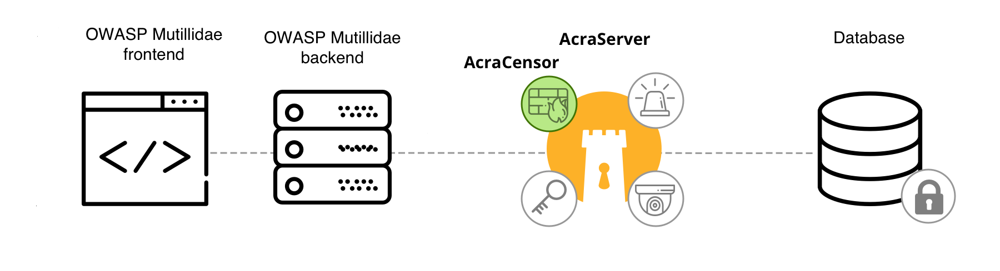
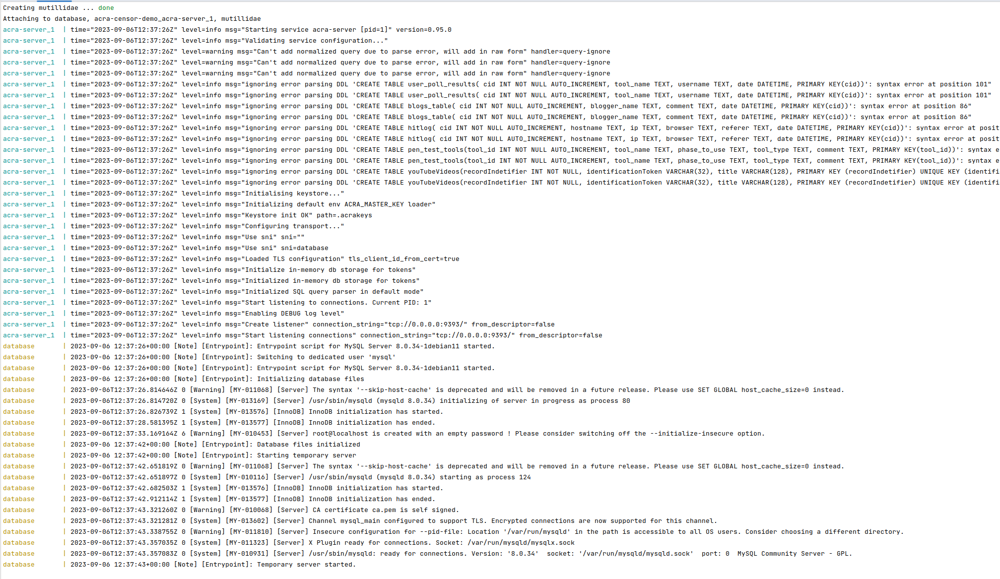

This project illustrates how to use [AcraCensor](https://docs.cossacklabs.com/pages/documentation-acra/#acracensor-acra-s-firewall) as SQL firewall to prevent SQL injections. Target application is a famous [OWASP Mutillidae 2 application](https://github.com/webpwnized/mutillidae). 

Demo project is a set of Docker containers, Acra works as proxy between web and database, thus AcraCensor inspect every SQL query that runs from the web application to the database, and back.

<p align="center"></p>


## How to run demo

1. Use docker-compose command to set up and run the whole infrastructure: 

```
export ACRA_DOCKER_IMAGE_TAG='master'
docker-compose -f docker-compose.acra-censor-demo.yml up
```




2. Check that containers up and running: 

```
docker ps -a
``` 


3. Open Mutillidae web portal at `localhost:8080`


4. The database is still empty, so we have to fill it first by clicking on `setup/reset the DB`. 

In docker console you should see SQL queries in Acra logs. After resetting the database, main page of Mutillidae application looks like this


## How to prevent SQL injections

1. First, select a vulnerable web page. In left menu go to "OWASP 2017" -> "A1 - Injection (SQL)" -> "SQLi - Extract data" -> User Info (SQL)


2. Now let's run SQL injection. Try to login any name and password `' or 1='1`. 

This will construct SQL query to database: `SELECT * FROM accounts WHERE username='' AND password='' or 1='1'` which is infected with malicious instruction. 


3. Now let's tune AcraCensor to prevent this injection. 

There are configuration files in `./.acraconfigs/acra-server/` folder:
- `acra-censor.norules.yaml` (minimal configuration that simply creates valueless AcraCensor)
- `acra-censor.ruleset01.yaml` (example: rule set based on typical allowlist - allow some / deny any other)
- `acra-censor.ruleset02.yaml` (example: rule set based on typical denylist - deny some / allow any other)
- `acra-censor.yaml` (active config, used by AcraCensor)

By default AcraCensor uses empty configuration file (not rules setup at all), to change that we should update configuration file.

Replace active config with `acra-censor.ruleset01.yaml` (or `acra-censor.ruleset02.yaml`) and restart `acra-server` container:

```bash
cp ./.acraconfigs/acra-server/acra-censor.ruleset01.yaml ./.acraconfigs/acra-server/acra-censor.yaml
docker restart <name or ID of acra-censor-demo_acra-server container>
```

You will see in the docker log, that AcraServer has restarted with updated configuration file:

```bash
acra-server_1_979c50cd7b3e | time="2019-02-05T18:53:22Z" level=info msg="Server graceful shutdown completed, bye PID: 1"
acra-censor-demo-master_acra-server_1_979c50cd7b3e exited with code 0
```


4. Try if new AcraCensor configuration prevents injections.


AcraCensor detects SQL injections better that WAF


At the same web page try to login again using password `' or 1='1`. 

You should see exception that MySQL server has gone away. In Acra's console you can find that malicious query is forbidden: 


5. Try other SQL injections

You can also test blocking other injections (if apply any of rule sets provided):
- into Name or Password textbox: `qwerty' OR 6=6 -- `
- into Password textbox: `' union select ccid,ccnumber,ccv,expiration,null,null,null from credit_cards -- `

6. Try other vulnerable web pages. Select one of the following:

- OWASP 2017 -> A1 Injection (SQL) -> SQLi Bypass Authentication -> Login
- OWASP 2017 -> A1 Injection (SQL) -> Blind SQL via Timing -> Login
- OWASP 2017 -> A2 Broken authentication ... -> Authentication bypass -> via SQL injection -> Login

and try to use `admin` as username and `' or 1='1` as password.

## What to do next

Let us know if you have any questions by dropping an email to [dev@cossacklabs.com](mailto:dev@cossacklabs.com).

1. Read more about how SQL firewall works and how it's different from WAF.
2. Watch slides about developers' perspective on [building SQL firewall](https://speakerdeck.com/storojs72/building-sql-firewall-insights-from-developers).
3. [cossacklabs/acra](https://github.com/cossacklabs/acra) – the main Acra repository contains tons of examples and documentation about Acra itself.
4. Play around with other [pre-built applications protected by Acra](https://github.com/cossacklabs/acra-engineering-demo/).


## Resources

- Using Acra in Docker (https://docs.cossacklabs.com/pages/trying-acra-with-docker/#using-acra-in-docker).
- Mutillidae Github (https://github.com/webpwnized/mutillidae)
- Mutillidae docker image by @edoz90 (https://github.com/edoz90/docker-mutillidae)
- Acra Github (https://github.com/cossacklabs/acra)
