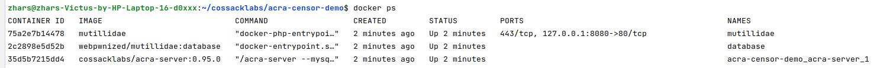
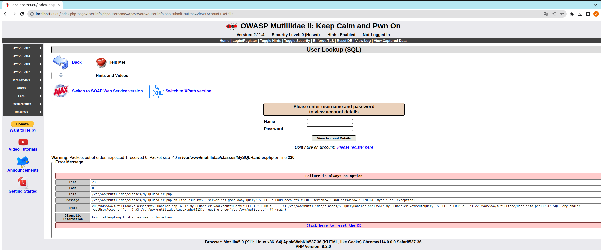

This project illustrates how to use [AcraCensor](https://docs.cossacklabs.com/pages/documentation-acra/#acracensor-acra-s-firewall) as SQL firewall to prevent SQL injections. Target application is a well-known vulnerable web application [OWASP Mutillidae 2](https://github.com/webpwnized/mutillidae). 

The demo project has a [Docker compose file](docker-compose.acra-censor-demo.yml) that runs the following web infrastructure:
- OWASP Mutillidae web application,
- [Acra encryption suite](https://github.com/cossacklabs/acra).

Acra works as a proxy between web and database. AcraCensor inspect every SQL query that runs from the web application to the database, and back.

<p align="center"></p>

This is a slide from [a talk by Cossack Labs' security software engineer Artem Storozhuk](https://speakerdeck.com/storojs72/building-sql-firewall-insights-from-developers) on building SQL firewalls, which illustrates how SQL firewalls can prevent more SQLi than WAF.


## Screencast

<a href="https://youtu.be/ABjIfx2_hJk" target="_blank"></a> 


## How to run the demo

1. Use docker-compose command to set up and run the whole infrastructure: 

```
export ACRA_DOCKER_IMAGE_TAG='master'
docker-compose -f docker-compose.acra-censor-demo.yml up
```


2. Check that the containers are up and running: 

```
docker ps -a
``` 



3. Open Mutillidae web portal at `localhost:8080`:


4. The database is still empty so we need to fill it first by clicking on `setup/reset the DB`. 

In the Docker console you should see SQL queries in Acra logs. After resetting the database, the main page of Mutillidae application looks like this:


## How to perform SQL injections

1. Start with selecting a vulnerable web page. In the menu on the left, go to "OWASP 2017" -> "A1 - Injection (SQL)" -> "SQLi - Extract data" -> User Info (SQL).


2. Now, let's run an SQL injection. Try to login any name and password `' or 1='1`. 

This will construct an SQL query `SELECT * FROM accounts WHERE username='' AND password='' or 1='1'` — containing a typical SQL injection — to the database. 


## How AcraCensor prevents SQL injections

1. Now, let's fine-tune AcraCensor for preventing this injection. 

There are configuration files in `./.acraconfigs/acra-server/` folder:
- `acra-censor.norules.yaml` (minimal configuration that simply creates valueless AcraCensor);
- `acra-censor.ruleset01.yaml` (example: ruleset based on typical allowlist - allow some / deny any other);
- `acra-censor.ruleset02.yaml` (example: ruleset based on typical denylist - deny some / allow any other);
- `acra-censor.yaml` (active config, used by AcraCensor).

AcraCensor uses empty configuration file by default (no rules setup at all). We need to update the configuration file to change that.

Replace the active config with `acra-censor.ruleset01.yaml` (or `acra-censor.ruleset02.yaml`) and restart the `acra-server` container:

```bash
cp ./.acraconfigs/acra-server/acra-censor.ruleset01.yaml ./.acraconfigs/acra-server/acra-censor.yaml
docker restart <name or ID of acra-censor-demo_acra-server container>
```

In the docker log, you will see that AcraServer has restarted with an updated configuration file:

```bash
acra-server_1_979c50cd7b3e | time="2019-02-05T18:53:22Z" level=info msg="Server graceful shutdown completed, bye PID: 1"
acra-censor-demo-master_acra-server_1_979c50cd7b3e exited with code 0
```


2. Test if the new AcraCensor configuration prevents injections.

On the same web page, try to login again using the password `' or 1='1`. 

You should see that the response from MySQL server is blocked. In Acra's console, you can see that the malicious query is forbidden: 



3. Try other SQL injections.

You can also test the process of blocking other injections (if applies to any of the provided rulesets):
- into Name or Password textbox: `qwerty' OR 6=6 -- `;
- into Password textbox: `' union select ccid,ccnumber,ccv,expiration,null,null,null from credit_cards -- `.

4. Try other vulnerable web pages. Select one of the following:

- OWASP 2017 -> A1 Injection (SQL) -> SQLi Bypass Authentication -> Login
- OWASP 2017 -> A1 Injection (SQL) -> Blind SQL via Timing -> Login
- OWASP 2017 -> A2 Broken authentication ... -> Authentication bypass -> via SQL injection -> Login

and try to use `admin` as a username and `' or 1='1` as a password.

## What to do next

Let us know if you have any questions by dropping an email to [dev@cossacklabs.com](mailto:dev@cossacklabs.com).

1. Read more about how SQL firewall works and how it is different from WAF.
2. See the slides about the developers' perspective on [building SQL firewall](https://speakerdeck.com/storojs72/building-sql-firewall-insights-from-developers).
3. Visit [cossacklabs/acra](https://github.com/cossacklabs/acra) – the main Acra repository that contains tons of examples and documentation about Acra (full documentation for Acra is on the [Documentation Server](https://docs.cossacklabs.com/products/acra/)). 
4. Play around with other [pre-built applications protected by Acra](https://github.com/cossacklabs/acra-engineering-demo/).


## Resources

- Using Acra in Docker (https://docs.cossacklabs.com/pages/trying-acra-with-docker/#using-acra-in-docker).
- Mutillidae Github (https://github.com/webpwnized/mutillidae).
- Mutillidae docker image by @edoz90 (https://github.com/edoz90/docker-mutillidae).
- Acra Github (https://github.com/cossacklabs/acra).
